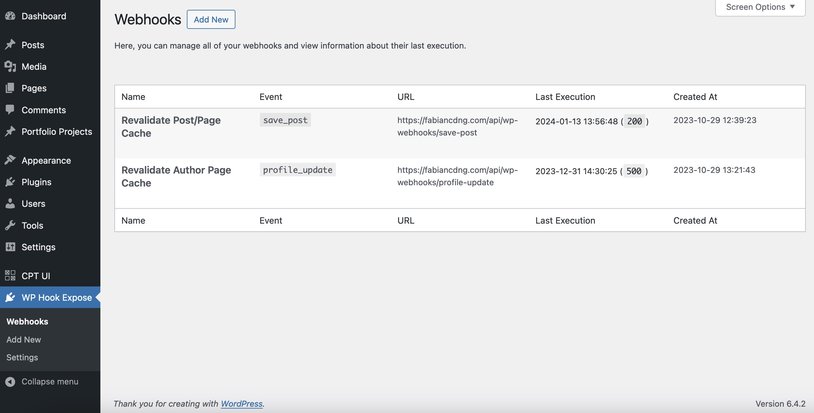
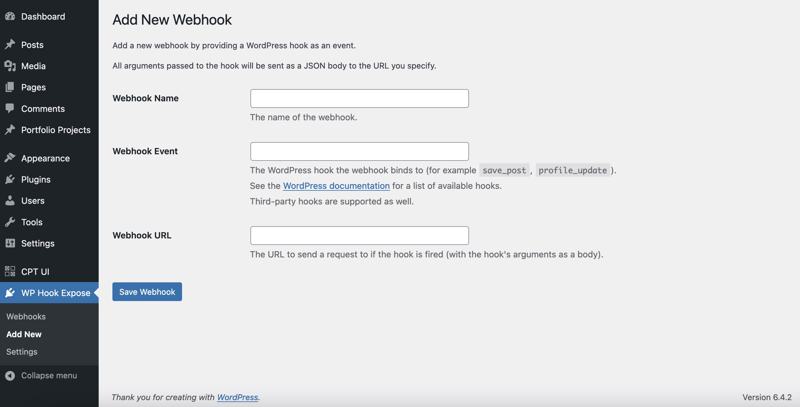
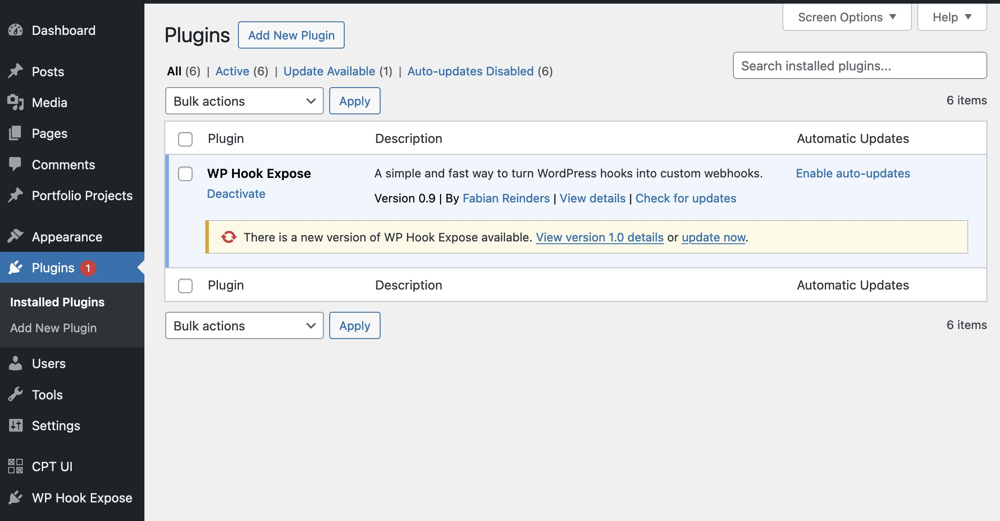

<h1>WP Hook Expose</h1>

<b>A simple and fast way to turn WordPress hooks into custom webhooks.</b>

---

## Table of Contents

* [Installation](#installation)
* [Webhooks](#webhooks)
    * [Managing webhooks](#managing-webhooks)
    * [Creating a new webhook](#creating-a-new-webhook)
    * [Potential pitfalls](#potential-pitfalls)
* [Upgrading to a new version](#upgrading-to-a-new-version)
* [Credits](#credits)

## Installation

1. Download the `wp-hook-expose.zip` file from
   the [latest release](https://github.com/fabiancdng/wp-hook-expose/releases/latest).
2. In your WordPress admin panel, navigate to `Plugins -> Add New`.
3. Click `Upload Plugin` at the top of the page.
4. Upload the `wp-hook-expose.zip` file.
5. Activate the plugin.

## Webhooks

### Managing webhooks

The plugin provides a UI to list, create, edit and delete webhooks all in the WordPress admin panel.

### How webhooks work

This plugin takes a different approach to webhooks than most other plugins.

Webhooks are not bound to pre-defined events or have pre-defined HTTP bodies.

All webhooks are subscribed to [WordPress actions](https://developer.wordpress.org/plugins/hooks/actions/) and turn them
into a webhook.

The arguments the WordPress action is called with are used as the HTTP body of the webhook.

This way you can create custom events for your webhooks super easily... just create a new WordPress action and you're
good to go!

### Creating a new webhook

You can choose the URL to send the webhook to and the WordPress action to use freely on the "Add New" screen.

### Potential pitfalls

Due to the nature of this plugin, there are some things to keep in mind:

* Webhooks send all arguments of the WordPress action as the HTTP body.
  This means that if you use a WordPress action that sends sensitive data as an argument, this data will be sent to the
  webhook URL.
  **Therefore, only point webhook requests at trusted URLs!**
* If a hook is called several times during the same HTTP request to your WordPress instance, a webhook is only sent off
  once.
  In a future version, this behavior might be configurable.

## Upgrading to a new version

Upgrading to a new version can be done entirely from within the WordPress admin panel. No need to upload a new zip file!

The plugin will automatically check for updates twice a day.

If you want to check for updates manually, you can click
the `Check for updates` button on the plugin's settings page.

## Credits

"WP Hook Expose" uses the following third-party open-source libraries and packages:

* [`plugin-update-checker`](https://github.com/YahnisElsts/plugin-update-checker) by Yahnis Elsts
